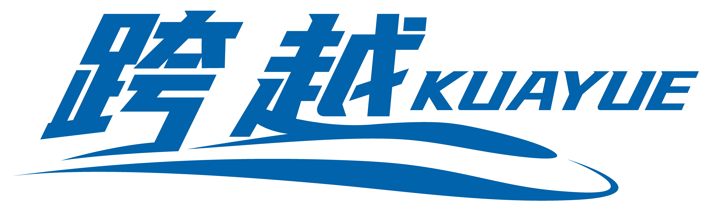

<!---
WIP, When the mod is released, please uncomment the following lines

-->

其他语言 | Other languages : <a href="README.en.md">English</a>

## 介绍

跨越是一个国铁风格的机械动力附属铁路模组。

作为装饰性模组和功能性模组，跨越为机械动力的铁路系统添加了国铁正在使用或已被淘汰的机车、客车、货车、车载和地面设备，并计划根据国铁规范实现一套功能玩法（如调度，驾驶等）。

## 截图

## 进度

## 开发组

## 特别鸣谢

## 许可证

本项目的代码使用 MIT 许可证。

本项目的美术资产和配方文件以 CC-BY-SA 协议进行许可，使用本模组制作视频等用途，请在较为显著的位置（如视频本体、简介、评论区；独立游戏、软件请放置于开源授权部分及README底部等）标注本模组，推荐引用 Github 链接。

[Creative Commons Attribution-ShareAlike 4.0 International License][cc-by-sa].

[![CC BY-SA 4.0][cc-by-sa-image]][cc-by-sa]
